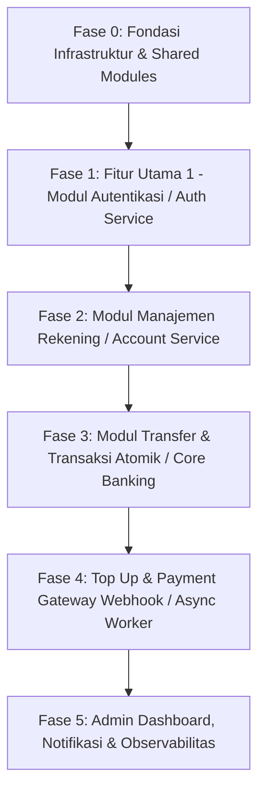

# Panduan Urutan Implementasi Fitur (Step-by-Step Implementation Guide)

Dokumen ini merupakan panduan kerja terstruktur (*execution roadmap*) dalam membangun backend layanan **Mini Bank App Architecture** (Go Fiber + SQLC/PGX + Redis + Docker + Kubernetes). Pengerjaan disusun secara berurutan (*dependency-first*), mulai dari fondasi infrastruktur hingga layanan mikroseluler perbankan.

---

## 🏗️ Urutan Pengerjaan & Fitur Pertama yang Wajib Dibuat

Dalam membangun arsitektur perbankan komersial yang modular, kita tidak bisa langsung melompati logika transfer atau payment gateway sebelum gerbang identitas dan fondasi sistem terpasang dengan kokoh. Berikut adalah urutan eksekusi lapis demi lapis:

### ⚙️ Fase 0: Fondasi Infrastruktur & Shared Modules (Persiapan Wajib)
Sebelum menulis logika bisnis, seluruh alat bantu lintas modul (*Shared Modules*) harus beroperasi:
1. **Config Parser (`pkg/config`):** Setup konfigurasi menggunakan **Viper** untuk membaca file `.env` atau environment variables (DB credentials, Redis host, JWT secret, port).
2. **Logger (`pkg/logger`):** Inisialisasi **Zap / Slog** untuk *structured logging* agar siap diagregrasi oleh Loki.
3. **Database & Caching Pool (`pkg/database` & `pkg/cache`):** 
   - Koneksi *connection pool* berkinerja tinggi ke **PostgreSQL** menggunakan driver **PGX (`pgxpool`)**.
   - Koneksi client ke **Redis** untuk manajemen sesi dan *rate limiter*.
4. **Utility & Helpers (`pkg/util`):** 
   - Fungsi pengacak & pemverifikasi kata sandi (*Bcrypt Password Hash*).
   - Generator & Verifikator **JWT Bearer Token**.
   - Validator UUID dan formatter angka desimal mata uang (*Currency/Decimal helper*).
5. **Router Setup (`cmd/api/main.go` & `pkg/middleware`):** Inisiasi server HTTP **Go Fiber**, Middleware CORS, Error Handler sentral, serta *Redis Rate Limiter*.

---

### 🔐 Fase 1: FITUR PERTAMA YANG HARUS DIBUAT — Modul Autentikasi (Auth Service)
**Mengapa ini dikerjakan paling awal?**
Hampir seluruh endpoint fungsional perbankan (seperti membuat rekening, cek saldo, transfer, dan top-up) membutuhkan identitas Nasabah yang dilindungi oleh **JWT Bearer Token**. Tanpa adanya modul otorisasi yang berfungsi baik, fitur-fitur kas finansial tidak dapat diproteksi maupun diuji secara realistis.

#### Lingkup Pengerjaan di Fase 1:
- **Database Migration & SQLC:** Membuat skema tabel `users` dan `audit_logs`, serta mendefinisikan query kueri SQLC untuk pendaftaran dan pencarian user berdasarkan email.
- **Repository & Domain Logic (`internal/auth`):**
  - **Register Account:** Registrasi nasabah baru (Nama, Email, Password Hash) dengan validasi duplikasi email.
  - **Login:** Verifikasi email & password, penghitungan token **JWT (+ Refresh Token)**, dan penyimpanan status token di **Redis Session Store**.
- **Auth Middleware (`pkg/middleware`):** Middleware pemutus akses bagi request HTTP yang tidak memiliki header `Authorization: Bearer <token>` yang valid.
- **Endpoints API:**
  - `POST /api/v1/auth/register` (Daftar Pengguna Baru)
  - `POST /api/v1/auth/login` (Masuk & Dapatkan JWT)
  - `POST /api/v1/auth/logout` (Hapus Sesi di Redis)

---

### 💳 Fase 2: Modul Manajemen Rekening (Account & Customer Service)
Setelah nasabah bisa mendaftar dan masuk, langkah selanjutnya adalah menciptakan entitas penampung uang (Rekening).
#### Lingkup Pengerjaan:
- **Database Migration & SQLC:** Skema tabel `accounts` dengan aturan proteksi saldo `CHECK (balance >= 0)`.
- **Domain Logic (`internal/account` & `internal/customer`):**
  - Generator Nomor Rekening Unik (misal: 10 digit kombinasi sistematis).
  - Pembukaan rekening baru dengan saldo awal (0 atau promo new value).
  - Pengecekan informasi saldo dan profil rekening aktif (didukung sementara oleh Redis Cache dengan TTL 15 menit).
  - Pengaturan status akun (Active / Frozen / Blocked).
- **Endpoints API (Protected by Auth Middleware):**
  - `POST /api/v1/accounts` (Buka rekening baru)
  - `GET /api/v1/accounts/my` (Lihat daftar & saldo rekening milik nasabah)
  - `GET /api/v1/accounts/:account_number` (Cek validasi nomor rekening tujuan sebelum transfer)

---

### 🔀 Fase 3: Core Banking — Modul Transaksi & Transfer Dana Atomik (Transfer & Transaction Service)
Inilah jantung utama dari aplikasi **Mini Bank**, di mana perpindahan kas nyata dievaluasi dengan keandalan tinggi.
#### Lingkup Pengerjaan:
- **Database Migration & SQLC:** Skema tabel `transactions` dan `journal_entries` (Buku Besar Akuntansi / Double-Entry Ledger).
- **Domain Logic (`internal/transfer` & `internal/transaction`):**
  - **Mitigasi Deadlock & ACID Transaction:** Menggunakan mekanisme penguncian baris DB (`SELECT ... FOR UPDATE` di PostgreSQL) secara bertingkat (urutan ID terkecil ke terbesar) agar transfer paralel antar dua rekening tidak mengalami kegagalan konkurensi (*race condition*).
  - Validasi saldo mencukupi sebelum pengurangan kas.
  - Penulisan otomatis log **Debit** (rekening asal) dan **Kredit** (rekening tujuan) di `journal_entries`.
  - Pembuatan nomor referensi mutasi bersertifikasi unik (`REF-YYYYMMDD-XXXX`).
- **Endpoints API:**
  - `POST /api/v1/transfers` (Transfer saldo antar rekening Mini Bank, mendukung header `X-Idempotency-Key`)
  - `GET /api/v1/transactions/history` (Lihat riwayat mutasi / rekening koran dengan filter rentang waktu & paginasi)

---

### 🪙 Fase 4: Modul Top Up & Integrasi Payment Gateway (`internal/topup`, `internal/payment`, & `cmd/worker`)
Menangani aliran masuk dana dari dunia luar melalui pihak ketiga (*Midtrans / Xendit*).
#### Lingkup Pengerjaan:
- **Database Migration & SQLC:** Skema tabel `payment_orders` untuk melacak tagihan Virtual Account / QRIS.
- **Domain Logic:**
  - Pembuatan order pengisian saldo (Top Up Order) berstatus `PENDING`.
  - **Webhook / Callback Handler:** Menerima notifikasi pembayaran sukses dari Payment Gateway dengan verifikasi tanda tangan kriptografik (*Signature Key Security*).
  - **Async Worker (`cmd/worker`):** Pengolahan Settlement melalui **Redis Queue**, menambahkan saldo ke rekening secara asinkron bila jaringan webhook padat atau terjadi gangguan jaringan sementara (*Auto-Retry Failed Settlement*).
- **Endpoints API:**
  - `POST /api/v1/topup/order` (Request Top Up via VA / QRIS)
  - `POST /api/v1/webhooks/payment` (Open Endpoint khusus Webhook callback Midtrans/Xendit)

---

### 📈 Fase 5: Modul Admin, Notifikasi & Observabilitas (`internal/admin`, `internal/notification`, & `internal/reporting`)
Langkah akhir penyempurnaan sistem operasional perbankan berskala enterprise.
#### Lingkup Pengerjaan:
- **Notification Service:** Worker asinkron penjepret pengiriman pesan (Email/SMS) ke nasabah setiap terjadi mutasi transfer atau top-up sukses.
- **Reporting Service:** Ekspor laporan keuangan berkala (Statemen Bulanan format PDF/Excel).
- **Admin Service:** Dasbor rekapitulasi total arus tunai (Cash-In / Cash-Out), manajemen pemblokiran akun bermasalah, dan audit log monitoring.
- **Observabilitas:** Integrasi metrik **Prometheus** (`/metrics`) pada Go Fiber untuk visualisasi trafik dan latensi di **Grafana**.

---

## 📑 Strategi Rangkuman Dokumentasi (Documentation Summary Workflow)

Sesuai aturan pengembangan yang rapi, **setelah penulisan kode setiap Fase / Fitur di atas terselesaikan**, AI dan pengembang wajib langsung menghasilkan atau memperbarui dokumen rangkuman teknis yang tersimpan terstruktur di folder `docs/`.

### Format Standar Rangkuman Dokumentasi Fitur
Setiap fitur yang selesai dikerjakan akan dinotifikasikan dan didokumentasikan dengan kerangka standar berikut:

1. **Ringkasan Eksekusi Modul:** Deskripsi singkat modul yang sukses diimplementasikan dan struktur filenya di `internal/`.
2. **Skema & Query SQLC:** Tabel database yang terhubung dan spesifikasi index/relasinya.
3. **Spesifikasi REST API Endpoint:**
   - URL & HTTP Method
   - Kebutuhan Headers (termasuk Token JWT & Idempotency Key)
   - Sample Contoh Request Body (JSON)
   - Sample Contoh Response Sukses (`200 OK` / `201 Created`) & Error Handling (`400 Bad Request` / `401 Unauthorized` / `500 Internal Error`)
4. **Cara Pengujian (Verification Guide):**
   - Perintah testing terminal: `go test -v -cover ./internal/<modul>/...`
   - Contoh perintah cURL atau koleksi request Postman/HTTP Client untuk pengujian langsung ke Docker container.

---
*Dokumen panduan ini menjadi kompas navigasi pengembangan utama untuk memastikan keseluruhan ekosistem Mini Bank terbangun solid tanpa cacat arsitektural.*
